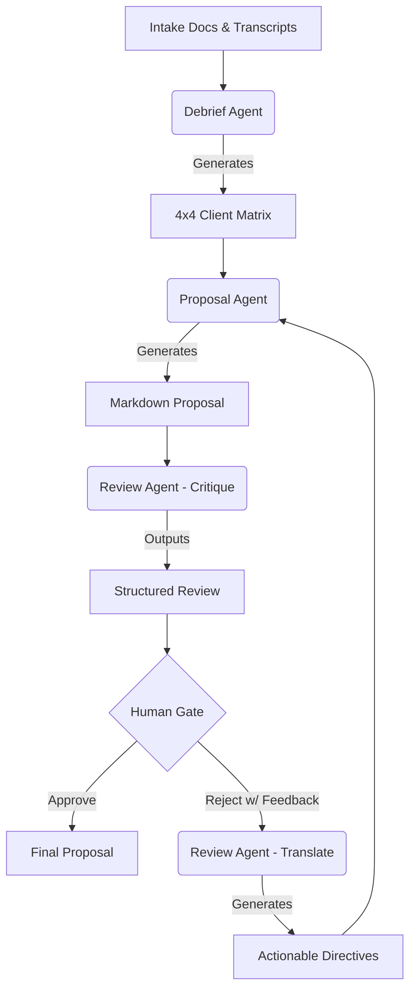

# Multi-Agent Client Proposal Pipeline

## Directory Structure & File Overview

Below is an overview of the directory structure and the purpose of each key file. All main code resides within the ai-engineer-assignment 1 directory.

```text
.
├── ai-engineer-assignment 1/
│   ├── data/                 # input data (intake forms, transcripts) used by the pipeline
│   ├── runs/                 # logs, artifacts, and LLM payloads for each run
│   ├── .env                  # Environment variable
│   ├── pipeline.py           # The main entry point that orchestrates the entire agent pipeline
│   ├── debrief_agent.py      # Extracts structured insights (ClientMatrix) from raw data
│   ├── proposal_agent.py     # Drafts the Markdown proposal using the ClientMatrix
│   ├── review_agent.py       # Critiques the draft and synthesizes human feedback into directives
│   ├── llm_provider.py       # Handles LLM API calls, rate-limiting (tenacity), and retries
│   ├── schemas.py            # Pydantic models (ClientMatrix, ReviewCritique, etc.) enforcing agent boundaries
│   ├── logger.py             # Tracks token usage, costs, and saves artifacts to the runs/ directory
│   ├── evals.py              # Automated evaluation scripts to verify pipeline accuracy and loop regression
│   ├── requirements.txt      # Python dependencies for the project
│   ├── README.md             # Detailed documentation for the specific assignment
│   └── ASSIGNMENT.md         # The original assignment instructions
├── README.md                 # This root documentation file
└── requirements.txt          # Root level dependencies
```

**Key Files to Know:**
- **`pipeline.py`**: Start here to understand the overarching flow. It ties the agents together, runs the loop, and manages the Human in the Loop (HITL) pause.
- **`schemas.py`**: Defines the critical data structures (like `ClientMatrix`) that ensure strict typing between agents. If you need to change what data is passed between agents, update this file first.
- **`llm_provider.py`**: Contains the `LLMProvider` class which wraps the `google-genai` SDK. It includes robust error handling and retry logic, so you don't have to worry about API rate limits in the agent scripts.
- **`*_agent.py`**: The individual agent scripts (`debrief_agent.py`, `proposal_agent.py`, `review_agent.py`) contain the system prompts and generation logic specific to their roles.

## 1. Architecture Diagram



## 2. Framework Choice
**Framework:** Native `google-genai` SDK + `tenacity` + `pydantic`
* **Zero Magic:** Instead of abstracting away control with heavy agent frameworks (like LangChain or CrewAI), the native SDK provides precise control over function calling and strict schema adherence.
* **Deterministic Reliability:** Pydantic models paired with Google's native structured output configuration guarantee that agent boundaries are strongly typed and won't fail unpredictably in production.
* **Granular Error Handling:** Wrapping native API calls with `tenacity` allows us to implement deliberate, customized retry logic for transient API failures without framework interference.

## 3. Why three agents and not two or four?
Could the Debrief and Proposal agents be a single well-prompted call? In theory, yes, but in practice, doing so violates the Single Responsibility Principle and degrades output quality. 
The Debrief Agent is optimized for *analytical extraction* (identifying contradictions and mapping data). The Proposal Agent is optimized for *creative synthesis* (writing cohesive, persuasive copy). Merging them dilutes the prompt focus, risking hallucinated consensus over the contradictions we need to preserve. We don't need a fourth agent because the Review Agent cleanly handles both critiquing and translation (since they both rely on analyzing the delta between the proposal and the matrix).

## 4. State Design
**Data Flow:** The pipeline passes state forward via strongly-typed Pydantic schemas (e.g., `ClientMatrix`, `ReviewCritique`, `TranslatedFeedback`).
**Feedback History Strategy:** *Summarized / Translated Directives.* 
Instead of concatenating raw human feedback across iterations (which leads to bloated context windows and contradictory instructions over time), the Review Agent *translates* the human's free-text feedback into a structured list of actionable directives. This ensures the Proposal Agent only receives clear, synthesized instructions relevant to the current iteration.

## 5. Termination Logic
The pipeline terminates under three conditions:
1. **Human Approval:** The user inputs 'approve' at the Human Gate. **Note:** Even if the Review Agent scores the proposal perfectly and recommends 'approve', the pipeline intentionally bypasses auto-termination to enforce mandatory Human-in-the-Loop (HITL) sign-off.
2. **Max Iterations:** The loop hits the default cap of 5 iterations.
3. **Divergence Detection (Repeat-Issue Detection):** The pipeline tracks the specific issues flagged by the Review Agent across iterations. If the Review Agent flags the exact same issue (location + description) in iteration *N* that it flagged in iteration *N-1*, the pipeline forcefully terminates. This prevents infinite loops where the Proposal Agent fails to fix a persistent issue.

## 6. Failure Modes Handled
1. **Transient API Errors / Rate Limits (Handled):** The `google-genai` API (especially on free tiers) frequently throws 429 Rate Limit and 503 Unavailable errors. I wrapped all LLM calls in a `tenacity` retry decorator with a fixed 65-second wait to cleanly bypass Google's aggressive 60-second quotas without crashing the pipeline.
2. **Schema Validation Failures (Handled):** If the LLM generates invalid JSON that violates the Pydantic schema, `pydantic` raises a validation error. Instead of immediately crashing, the pipeline catches this exception, appends the error directly into the LLM prompt (`[SYSTEM NOTIFICATION: Your previous response failed schema validation...]`), and executes an inner 3-retry loop, allowing the LLM to autonomously correct its own formatting before bubbling up to a critical failure.
3. **Prompt Injection (Handled):** Untrusted transcripts may contain malicious instructions (e.g., "ignore previous instructions"). The Debrief Agent wraps the transcript in `<untrusted_transcript>` XML tags and includes a strict `SECURITY DIRECTIVE` in its system prompt to treat the contents purely as passive data.

## 7. Stretch Goals Implemented
* **Mixed Model Tiers (Cost / Intelligence Optimization):** The pipeline intelligently routes workloads to optimize cost and reasoning. The Debrief Agent (extraction) and Review Agent (critique/translation) require high intelligence and use the flagship `gemini-3.1-pro-preview`. The Proposal Agent (synthesis/writing) handles a simpler text-generation task and uses the faster, significantly cheaper `gemini-3.6-flash`. The `logger.py` dynamically tracks this with per-model pricing logic.
* **Third Evaluation (Proposal Coherence):** Added a third LLM-as-a-judge evaluation script (`eval_proposal_coherence` in `evals.py`) to systematically verify that the generated proposal includes all 6 required sections, addresses all 'high' confidence matrix items, and strictly places 'contradicted' items in the Open Questions section.
* **Divergence Detection:** (See Termination Logic #3).
* **Prompt Injection Awareness:** (See Failure Modes #3).
* **Checkpoint / Branching:** At every Human Gate, the entire pipeline state is dumped to a `checkpoint_iter_{N}.json` file. The CLI supports a `--resume <file>` flag, allowing users to branch off from any previous iteration without restarting the pipeline!

## 8. What I'd do with another 4 hours
* Write comprehensive unit tests for the Pydantic boundary schemas to ensure edge-case transcripts don't break the JSON parsers.
* Wire up a rich Terminal UI (using `rich` or `textual`) to make the Human Gate review process cleaner and more readable than standard `print()` statements.

## 9. What would change for a production deployment
* **State Persistence:** Move state from local `.json` checkpoint files to a proper database (e.g., PostgreSQL or MongoDB) for distributed, asynchronous access.
* **Queueing:** Decouple the agents using a message broker (like RabbitMQ or Redis) so that heavy Proposal Agent generation tasks don't block the main thread, allowing concurrent processing of multiple client pipelines.
* **Observability:** Replace the local `logger.py` with Datadog or LangSmith for centralized tracing, cost monitoring, and alerting on LLM failure rates.
