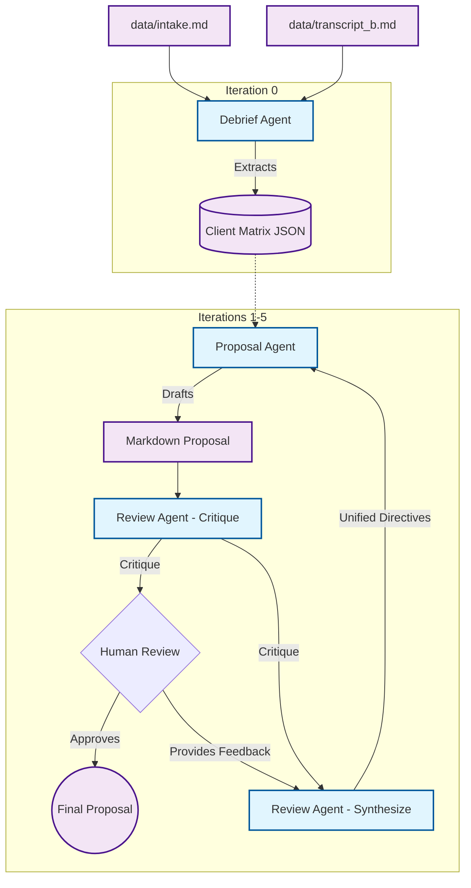

# Multi-Agent Proposal Generation Pipeline

This project implements a multi-agent AI pipeline to synthesize raw client intake materials and transcripts into a polished, structured Markdown proposal.

## 1. Architecture Diagram



## 2. Framework Choice
I chose to use **Raw SDK + state machine** (using the google-genai library and pydantic).
- **Transparency:** No hidden prompt or black-box orchestration. It gives me complete control over exactly what goes into the LLM context and what not.
- **Strict Typing:** Seamless integration with Pydantic for rigid schema validation at every comunication point between agents.
- **Flexibility:** Building a custom for loop for the human in the loop iteration process was much simpler than using something like lang graph because i have already implemented this human in the loop concept in my Project Verimate(https://verimate.merledupk.org/) which was an agentic tool for accelerating the time consuming process of hardware verification using local LLM's because of confidential hardware specs..

## 3. Why Three Agents (and not two or four)?
**Debrief and Proposal cannot be collapsed into one call.** Extracting contradictions into a structured matrix requires accuracy and high determinism (temperature=0.2). And writing a proposal requires natural language creativity (temperature=0.7). Mixing them degrades both.

**The Review Agent must be independent.** If the Proposal Agent critiqued its own work in the same LLM call, it would suffer from severe confirmation bias. An independent critic acts unbiasedly to catch hallucinated text or ignored contradictions.

## 4. State Design
State flows linearly between boundaries using strict Pydantic schemas (ClientMatrix, ReviewCritique, TranslatedFeedback). 

**Feedback History Strategy:** We feed only the latest translated directives or feedback and the prior draft into the Proposal Agent. 
- **Justification:** Feeding the entire historical feedback history bloats the context window, confusing instructions (e.g., "Change X to Y" in Iteration 1, followed by "Change Y back to X" in Iteration 3). Providing the prior draft ensures continuity while providing only the latest feedback and ai critique ensures the agent focuses purely on the current issues.

## 5. Termination Logic
The pipeline terminates under the following conditions:
1. **Human Approval:** The user explicitly types "approve".
2. **Iteration Cap:** Hardcoded to max_iterations = 5 to prevent infinite loops and cap costs and the LLM was generating the best proposal under that.
3. *(Removed)* **Divergence Detection:** We originally implemented a feature that terminated the pipeline if the Proposal Agent made the exact same mistake across multiple iterations (detected via issues intersection). And also i was appending the translated text and the ai critique to the proposal agent with prior proposal and matrix. This was later updated with to make the translated text in to the correct combination of ai crtique generated by the review agent and the feedback or order or human, than it was directely sends to the proposal agent with more clean context with optimized tokens along with the prior proposal and matrix.

## 6. Observability
Every LLM payload (prompts, raw outputs, latency, token usage) and Pydantic artifact is saved to disk in a timestamped runs/ directory. This ensures complete observability into what the LLM generated and why

## 7. Failure Handling & Prompt Engineering
- **Schema Validation Failure:** In llm_provider.py, if generate_structured fails to parse the JSON in to the Pydantic schema, it catches the error and feeds it back to the LLM ([SYSTEM NOTIFICATION: Your previous response failed schema validation...]) allowing it to self correct up to 3 times before crashing.
- **Transient API Errors & Rate Limits:** Wrapped all LLM calls in a tenacity retry block with exponential backoff to handle 429 and 503 errors seamlessly up to 5 attempts with the gap of 65 secs because when the gemini RPM(request per minute) limits hits calling the LLM again after 10 to 15 secs refresh the timeout limit back to 1 minute so to prevent that we choose the attempt to be after 65 secs
- **Hallucination Prevention (Prompt Engineering):** To prevent hallucinations, the Proposal Agent is explicitly instructed to move contradicted items directly to the Open Questions section, rather than resolving them on its own. Furthermore, we tightly constrain the context window by only sending the delta (feedback directives) rather than the entire conversational history.

## 8. What I'd do with another 4 hours
- **Parallel Critics:** Split the Review Agent into two parallel critics: a Tone critic and a Technical Accuracy critic, merging their outputs before presenting to the human.
- **State Branching:** Save the full state to disk at every human_gate and allow the CLI to branch from a specific iteration e.g."--resume runs/iter_2.json" so a user can explore alternative proposals without losing their main draft.
- **Real Tool Wiring:** Connect the lookup_similar_engagement tool to an actual local vector database (like Chroma) of past proposals, rather than returning fake or mock data.

## 9. What would change for a production deployment
- **UX:** Move from a CLI to a rich cli or web UI with real time text streaming so the user can watch the proposal being drafted.
- **Persistence:** Replace local filesystem logging (runs/) with a managed database.
- **Asynchronous Execution:** Offload the agent pipeline to a background task queue so long-running LLM calls do not block the web server or use multiple api keys.

## 10. Model Selection
- **Debrief & Proposal Agents:** gemini-3.1-pro-preview. These agents perform heavy reasoning tasks (detecting semantic contradictions in a 60minute transcript and generating a structured proposal).
- **Review Agent (Critique & Synthesize):** gemini-3.6-flash. The review and synthesis or translation tasks are highly constrained formatting exercises (turning paragraphs into bulleted lists and checking for missing sections). Using Flash here significantly improves iteration latency and reduces token costs because it is cheap without sacrificing quality, as handled automatically by our PipelineLogger.

## 11. Agents Overview
1. **Debrief Agent:** Consumes raw text (intakes and transcripts) and structures it into a strict 4x4 JSON ClientMatrix. Its primary goal is to isolate high confidence facts from contradicted statements.
2. **Proposal Agent:** Consumes the ClientMatrix and drafts a 6 section MD proposal. It enforces rules like pushing contradicted items into the "Open Questions" section.
3. **Review Agent:** Acts as an independent critic. It first critiques the drafted proposal for rule violations (e.g., missing sections, hallucinations). It then acts as a Synthesizer/Translate to merge its own critique with the human's feedback into a clean, unified list of directives for the Proposal Agent's next draft.

## 12. Evals Overview
The evals.py suite contains automated tests to ensure the pipeline rules hold true:
- **Eval 1 (Contradiction Recall):** Ensures the Debrief Agent correctly flags the hidden budget, timeline, and scope contradictions in transcript_b.md.
- **Eval 2 (Loop Regression):** Verifies that the Proposal Agent correctly applies feedback to a V1 mock draft without silently rewriting unrelated sections.
- **Eval 3 (Proposal Coherence):** Uses LLM-as-a-judge to verify that the final proposal contains all 6 required sections, addresses every high-confidence item, and properly tackles low-confidence items in Open Questions.

---
## Setup & Usage

### 1. Configure Environment
Create a virtual env and download the dependencies using requirment.txt file, Than create .env file in the ai-engeeniring directory with your API key:
```env
GEMINI_API_KEY=your_api_key_here
```

### 2. Run the Pipeline
```bash
python3 pipeline.py data/intake.md data/transcript_b.md
```
During the human review pause, type "approve" to finish, or provide free text feedback for the next iteration. Logs, artifacts, and LLM payloads are saved in runs/.

### 3. Run Evals
```bash
python3 evals.py
```
